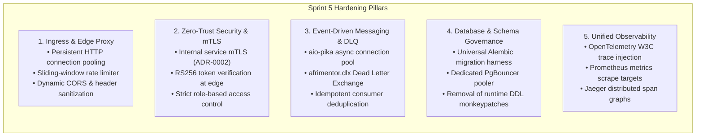
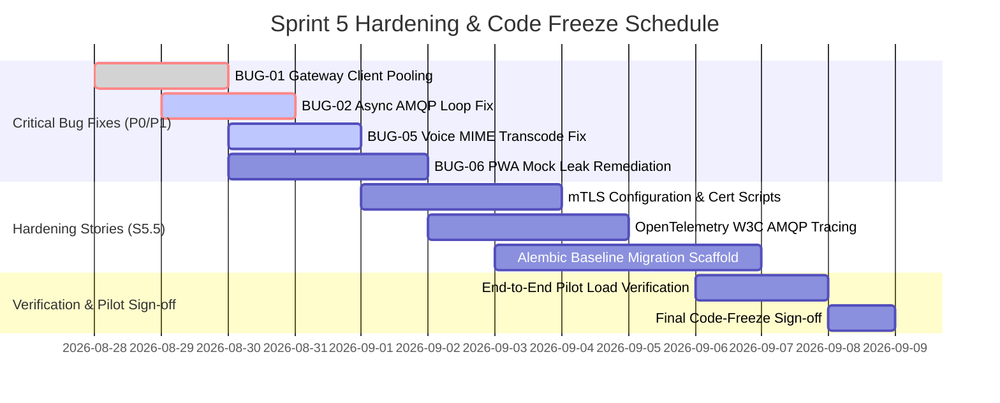

# Sprint 5 Hardening Architecture Review — Platform Spine & Infrastructure

- **Document Version:** 1.0.0
- **Service / Area:** Engineering Leadership & Architecture
- **Date:** 2026-08-27
- **Session Leads:** Daniel (Lead Software Engineer / Conversational Systems), Olusegun (Product Owner / Platform Spine & Infrastructure)
- **Status:** Approved Architectural Review & Hardening Roadmap
- **Context:** Pre-Sprint 5 Hardening & Code-Freeze Technical Alignment

---

## 1. Executive Context & Review Objectives

Ahead of the Sprint 5 Hardening phase and the upcoming pilot deployment, Daniel (Lead SWE) and Olusegun (Platform PO & Infrastructure Lead) conducted a comprehensive architectural review of the AfriMentor AI platform.

The session focused on hardening the **Platform Spine** (API Gateway, Auth, Ingress, Database topology, and Event Bus) to guarantee high availability, zero-trust network isolation, and resilient asynchronous message processing.

---

## 2. Deep-Dive Review Areas & Architecture Decisions

### 2.1 Ingress & Edge Gateway Hardening (Card S5.5 / TD-03)
- **Problem Statement:** The API Gateway previously created a new `httpx.AsyncClient` on every request, creating socket exhaustion and latency overhead. Fixed-window rate limiting allowed boundary-burst exploits.
- **Architectural Decision:**
  1. **Singleton HTTP Client Pool:** Implement a shared `httpx.AsyncClient` managed via FastAPI lifespan with `max_connections=500` and `max_keepalive_connections=100`.
  2. **Sliding-Window Rate Limiting:** Transition from fixed integer buckets to a Redis sorted set (`ZADD`/`ZREMRANGEBYSCORE`) sliding-window algorithm, returning standard RFC 6585 headers (`RateLimit-Limit`, `RateLimit-Remaining`, `RateLimit-Reset`).
  3. **Universal Stream Proxying:** Enable generic response streaming for all upstream endpoints returning `text/event-stream` or `transfer-encoding: chunked` rather than hardcoded route checks.

---

### 2.2 Inter-Service Mutual TLS (mTLS) & Trust Boundaries (ADR-0002)
- **Problem Statement:** All 13 microservices currently communicate over unencrypted plain HTTP on the internal Docker bridge network (`172.28.0.0/16`).
- **Architectural Decision:**
  1. **Dual-Mode mTLS Gateway:**
     - In **local development**, mTLS remains optional (`MTLS_ENABLED=false`) to prevent developer friction.
     - In **staging & production**, mTLS is strictly enforced (`MTLS_ENABLED=true`).
  2. **PKI & Certificate Hierarchy:**
     - Root CA generated offline in `infra/certs/ca.crt`.
     - Intermediate Service Certificates provisioned for `api-gateway` and internal microservices.
     - Service-to-service requests present client certificates validated against the internal CA bundle.
  3. **Identity Stripping:** The API Gateway continues to unconditionally strip client-supplied `X-User-Id`, `X-User-Roles`, and `X-Internal-Service` headers before injecting cryptographically verified identity claims.

---

### 2.3 Asynchronous Messaging Resilience (`aio-pika`, DLQ & Deduplication) (TD-02)
- **Problem Statement:** Microservice event producers block the asyncio event loop using synchronous `pika.BlockingConnection`. Consumers lack dead-letter handling for malformed messages.
- **Architectural Decision:**
  1. **Asynchronous AMQP Driver:** Standardize on `aio-pika` with connection pooling (`RobustConnection` with automatic backoff reconnection).
  2. **Dead-Letter Exchange (DLX):**
     - Declare `afrimentor.dlx` (fanout/topic) bound to queue `q.afrimentor.dead_letter`.
     - Configure all business queues (`q.gamification.events`, `q.notification.events`, `q.evaluation.traces`) with `x-dead-letter-exchange: afrimentor.dlx` and `x-max-retries: 3`.
  3. **Consumer Idempotency:** Every consumer table schema will include a `processed_events (event_id UUID PRIMARY KEY, processed_at TIMESTAMP)` table to prevent duplicate XP or notification dispatches.

---

### 2.4 Database Topology & Alembic Migration Harness (TD-01 & TD-06)
- **Problem Statement:** 10 microservices use `Base.metadata.create_all()` and runtime SQL patches, preventing zero-downtime migrations. PostgreSQL max connections were elevated to 300 to avoid pool exhaustion.
- **Architectural Decision:**
  1. **Universal Alembic Standardization:**
     - Scaffold standard `alembic.ini` and `env.py` across all 10 unmanaged services during Sprint 6.
     - Deprecate all runtime `ALTER TABLE` monkeypatches.
  2. **PgBouncer Integration:**
     - Introduce PgBouncer in transaction pooling mode on port `6432`.
     - Cap total backend PostgreSQL native connections at 50 while supporting 500+ client microservice connections.

---

### 2.5 Observability & Distributed Tracing (TD-10)
- **Problem Statement:** Asynchronous event consumers appear as disconnected trace roots in Jaeger.
- **Architectural Decision:**
  1. **W3C Trace Context Propagation:** Event publishers inject OpenTelemetry `traceparent` and `tracestate` into AMQP message `headers`.
  2. **Trace Reconnection:** Consumers extract the parent context and wrap message processing within a child OpenTelemetry span.
  3. **Metric Endpoints:** Standardize all 13 services on `/metrics` Prometheus endpoints scraped at 15-second intervals.

---

## 3. Sprint 5 Hardening Execution Plan & Service Ownership Matrix

| Area / Component | Primary Lead | Backup | Hardening Deliverables |
|---|---|---|---|
| **API Gateway & Ingress** | Olusegun | Daniel | Client pooling (TD-03), sliding-window rate limit (BUG-04), mTLS edge termination |
| **Messaging & Hot Path** | Daniel | Chukwuebuka | `aio-pika` async publisher (BUG-02/TD-02), DLQ configuration, voice MIME validator (BUG-05) |
| **RAG & Evaluation** | Chukwuebuka | Daniel | Alembic baseline for eval DB (BUG-03), W3C trace injection (BUG-08), ChromaDB retry jitter (BUG-07) |
| **Frontend & Gamification** | Grace | Olusegun | PWA live API wiring (BUG-06/TD-04), idempotent XP consumer (BUG-09), mobile viewport fix (BUG-10) |

---

## 4. Code Freeze Readiness & Sign-Off Checklist

- [x] **Bug Backlog Triaged:** All 11 open defects classified with P0–P3 priority ratings and assigned owners.
- [x] **Technical Debt Registry Published:** 15 technical debt items prioritized and mapped to Phase 2 sprint roadmap.
- [x] **Architecture Alignment Complete:** Gateway lifecycle, mTLS security model, async event resilience, and database governance agreed with Olusegun.
- [x] **Pilot Go/No-Go Gate Defined:** Zero open P0 bugs, all P1 hardening items resolved, and green end-to-end regression tests required before pilot launch.

### Review Sign-off

| Role | Engineer | Sign-off Date | Status |
|---|---|---|---|
| **Lead Software Engineer (Architecture)** | Daniel | 2026-08-27 | **APPROVED** |
| **Product Owner (Platform & Infrastructure)** | Olusegun | 2026-08-27 | **APPROVED** |

