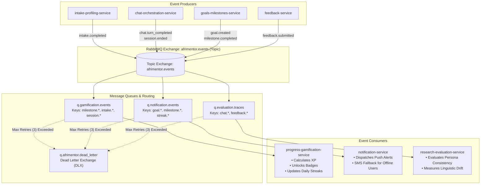
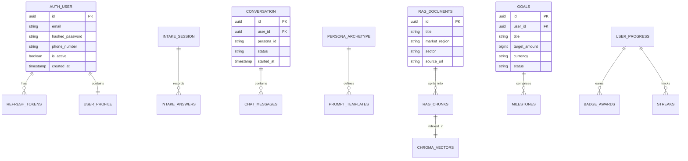
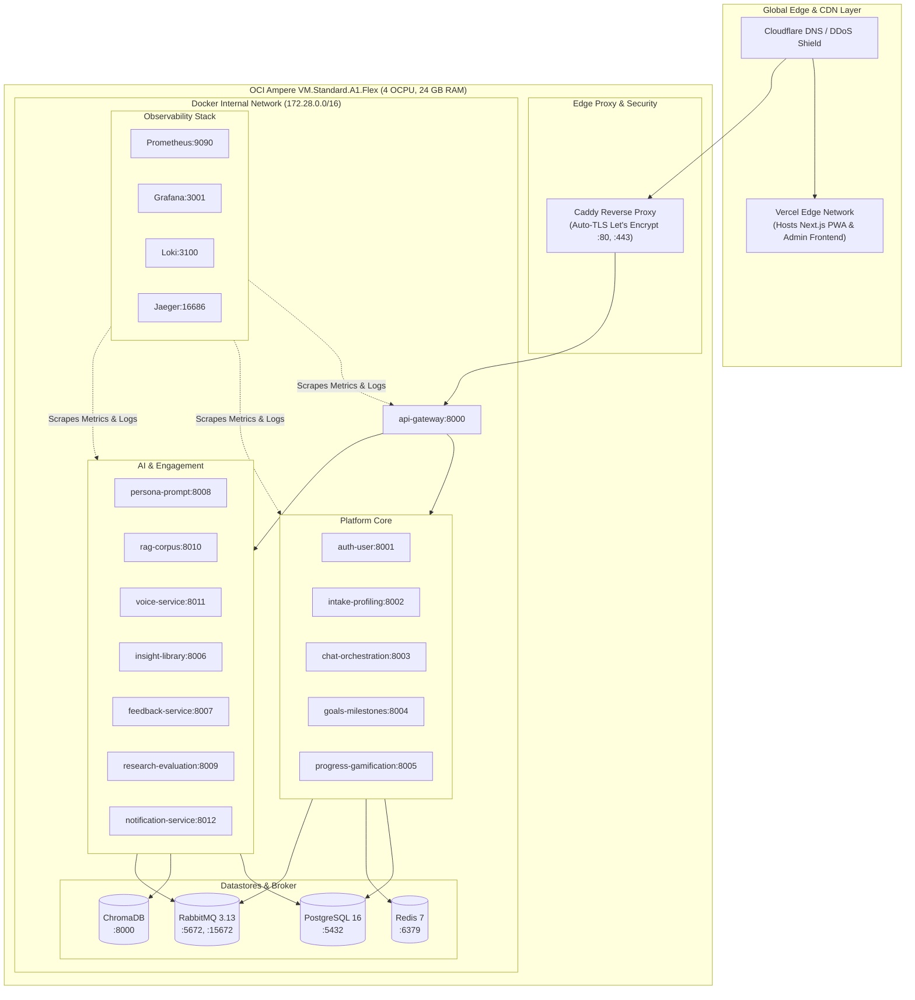
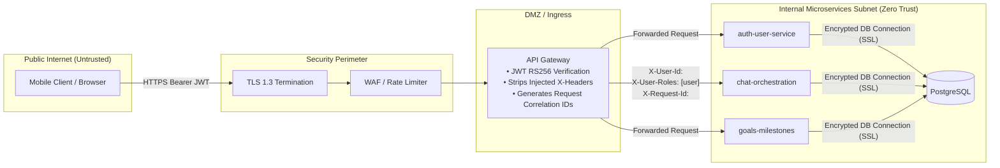

# System Architecture & Technical Design

- **Document Version:** 1.0.0 (Post-MVP Production Blueprint)
- **Area:** Engineering Leadership
- **Target Audience:** Engineering Team, SRE/DevOps, Tech Leads, External Auditors
- **Status:** Approved / Active

---

## 1. Executive Summary

AfriMentor AI is a distributed, mobile-first financial mentorship platform engineered specifically for African emerging markets, informal sector workers, and low-end mobile devices. The backend is designed around a microservices architecture of **13 specialized services**, a centralized **API Gateway**, an asynchronous **RabbitMQ Event Bus**, logical **Database-per-Service** isolation on PostgreSQL, and a dedicated **ChromaDB Vector Store** for Retrieval-Augmented Generation (RAG).

```
┌─────────────────────────────────────────────────────────────────────────────────┐
│                                CLIENT SURFACE                                   │
│   Next.js 16 PWA (Mobile-first)             Admin & Research Console (Web)     │
└────────────────────────────────────────┬────────────────────────────────────────┘
                                         │ HTTPS / WSS
                                         ▼
┌─────────────────────────────────────────────────────────────────────────────────┐
│                                 API GATEWAY                                     │
│     Rate Limiting (Redis) • JWT Verification (RS256) • Identity Propagation     │
└────────────────────────────────────────┬────────────────────────────────────────┘
                                         │ Internal HTTP / mTLS
             ┌───────────────────────────┴───────────────────────────┐
             ▼                                                       ▼
┌─────────────────────────┐                             ┌─────────────────────────┐
│   CORE CONVERSATION     │                             │   DOMAIN CAPABILITIES   │
│ • chat-orchestration    │                             │ • auth-user             │
│ • persona-prompt        │                             │ • intake-profiling      │
│ • rag-corpus            │                             │ • goals-milestones      │
│ • voice-service         │                             │ • progress-gamification │
└────────────┬────────────┘                             │ • insight-library       │
             │                                          │ • feedback-service      │
             │                                          │ • notification-service  │
             │                                          │ • research-evaluation   │
             │                                          └────────────┬────────────┘
             │                                                       │
             └───────────────────────────┬───────────────────────────┘
                                         │ Domain Events (AMQP)
                                         ▼
┌─────────────────────────────────────────────────────────────────────────────────┐
│                    EVENT BROKER (RabbitMQ: afrimentor.events)                   │
│          Fanout / Topic routing to async workers, notification & audit          │
└─────────────────────────────────────────────────────────────────────────────────┘
```

---

## 2. High-Level Architecture (C4 Container Diagram)

The following diagram illustrates the major containers, runtime boundaries, communication protocols, and datastores across the AfriMentor AI ecosystem.

```mermaid
C4Container
    title AfriMentor AI - High-Level Container Diagram

    Person(user, "End User", "Micro-entrepreneur or informal sector earner accessing mentorship on mobile.")
    Person(admin, "Researcher / Admin", "Platform operator auditing chats, monitoring drift, and reviewing metrics.")

    System_Boundary(c1, "AfriMentor AI Platform") {
        Container(mobile_app, "Mobile Web App (PWA)", "Next.js 16, React 19, Tailwind", "Delivers responsive, lightweight UI, offline-tolerant forms, and audio capture.")
        Container(admin_app, "Admin & Research Console", "Next.js 16, Tailwind", "Evaluation dashboard, metric suite, and prompt catalog manager.")

        Container(gateway, "API Gateway", "FastAPI, Python 3.11, Redis", "Ingress reverse proxy, RS256 token verification, rate limiting, and route dispatch.")

        Container(svc_auth, "auth-user-service", "FastAPI, SQLAlchemy", "User authentication, profile management, and RS256 JWT key authority.")
        Container(svc_intake, "intake-profiling-service", "FastAPI, SQLAlchemy", "Guided onboarding, socio-economic and informal sector profiling.")
        Container(svc_chat, "chat-orchestration-service", "FastAPI, SQLAlchemy, SSE", "Hot-path chat execution, context assembly, and LLM streaming pipeline.")
        Container(svc_persona, "persona-prompt-service", "FastAPI, SQLAlchemy", "Archetype engine, prompt templates, and culturally grounded personas.")
        Container(svc_rag, "rag-corpus-service", "FastAPI, ChromaDB, SentenceTransformers", "Financial literature vector indexing, chunking, and semantic retrieval.")
        Container(svc_goals, "goals-milestones-service", "FastAPI, SQLAlchemy", "Goal creation, step tracking, and financial milestone state machine.")
        Container(svc_gamification, "progress-gamification-service", "FastAPI, SQLAlchemy", "XP progression, badge achievements, and financial habit streaks.")
        Container(svc_insight, "insight-library-service", "FastAPI, SQLAlchemy", "Curated localized financial literacy cards and bookmarks.")
        Container(svc_feedback, "feedback-service", "FastAPI, SQLAlchemy", "CSAT surveys, thumbs-up/down ratings, and textual feedback.")
        Container(svc_eval, "research-evaluation-service", "FastAPI, SQLite/Postgres", "Persona drift probing, safety alignment, and response quality scoring.")
        Container(svc_voice, "voice-service", "FastAPI, FFmpeg, Whisper/TTS", "Audio upload processing, Speech-To-Text (STT), and Text-To-Speech (TTS).")
        Container(svc_notification, "notification-service", "FastAPI, Celery/Redis", "Push notifications, SMS reminders, and in-app action alerts.")

        ContainerDb(db_postgres, "PostgreSQL 16", "PostgreSQL", "Database-per-service logical isolation (svc_auth, svc_chat, svc_goals, etc.).")
        ContainerDb(db_redis, "Redis 7", "In-Memory Key-Value", "Token blacklist, gateway rate-limiting counters, and session caches.")
        ContainerDb(db_chroma, "ChromaDB", "Vector Database", "Embeddings collection for African financial guides and regional regulations.")
        ContainerQueue(broker_rmq, "RabbitMQ 3.13", "AMQP Topic Broker", "Asynchronous domain event exchange (afrimentor.events).")
    }

    System_Ext(ext_llm, "External LLM Providers", "Gemini 2.5 Flash / Groq / OpenAI / Mistral", "Generative language models with culturally tuned system prompts.")
    System_Ext(ext_sms, "Telecom SMS / Push Gateways", "AfricasTalking / Firebase FCM", "SMS alerts and mobile push delivery.")

    Rel(user, mobile_app, "Interacts with", "HTTPS / WSS")
    Rel(admin, admin_app, "Administers and audits", "HTTPS")

    Rel(mobile_app, gateway, "API Requests", "JSON / HTTPS / WSS")
    Rel(admin_app, gateway, "Admin API Requests", "JSON / HTTPS")

    Rel(gateway, db_redis, "Checks rate limits & sessions", "RESP")
    Rel(gateway, svc_auth, "Dispatches /auth", "HTTP / JSON")
    Rel(gateway, svc_chat, "Dispatches /chat", "HTTP / SSE")
    Rel(gateway, svc_intake, "Dispatches /intake", "HTTP / JSON")
    Rel(gateway, svc_goals, "Dispatches /goals", "HTTP / JSON")
    Rel(gateway, svc_gamification, "Dispatches /progress", "HTTP / JSON")
    Rel(gateway, svc_insight, "Dispatches /insights", "HTTP / JSON")
    Rel(gateway, svc_feedback, "Dispatches /feedback", "HTTP / JSON")
    Rel(gateway, svc_eval, "Dispatches /eval", "HTTP / JSON")
    Rel(gateway, svc_voice, "Dispatches /voice", "HTTP / Multipart")

    Rel(svc_chat, svc_persona, "Fetches persona prompt", "Sync REST")
    Rel(svc_chat, svc_rag, "Queries vector context", "Sync REST")
    Rel(svc_chat, ext_llm, "Executes prompt & streams tokens", "HTTPS")

    Rel(svc_rag, db_chroma, "Stores & queries vectors", "Chroma Native / gRPC")

    Rel_Back(svc_auth, db_postgres, "Reads/Writes user data", "SQL")
    Rel_Back(svc_intake, db_postgres, "Reads/Writes intake answers", "SQL")
    Rel_Back(svc_chat, db_postgres, "Reads/Writes messages", "SQL")
    Rel_Back(svc_persona, db_postgres, "Reads/Writes templates", "SQL")
    Rel_Back(svc_goals, db_postgres, "Reads/Writes goals", "SQL")
    Rel_Back(svc_gamification, db_postgres, "Reads/Writes XP & streaks", "SQL")
    Rel_Back(svc_insight, db_postgres, "Reads/Writes content", "SQL")
    Rel_Back(svc_feedback, db_postgres, "Reads/Writes CSAT", "SQL")

    Rel(svc_intake, broker_rmq, "Emits intake.completed", "AMQP")
    Rel(svc_chat, broker_rmq, "Emits message.created, session.ended", "AMQP")
    Rel(svc_goals, broker_rmq, "Emits goal.created, milestone.completed", "AMQP")
    Rel(svc_feedback, broker_rmq, "Emits feedback.submitted", "AMQP")

    Rel(broker_rmq, svc_gamification, "Delivers events to award XP/badges", "AMQP")
    Rel(broker_rmq, svc_notification, "Delivers events to dispatch alerts", "AMQP")
    Rel(broker_rmq, svc_eval, "Delivers session traces for audit", "AMQP")

    Rel(svc_notification, ext_sms, "Sends SMS & Push notifications", "HTTPS")
```



---

## 3. Synchronous Request Flows & Conversational Hot Path

The conversational hot path is optimized for low p95 latency (< 1,200ms TTFT - Time To First Token) and memory efficiency. The diagram below details the sequence of a user submitting a chat message to Chioma (the primary mentor persona).

```mermaid
sequenceDiagram
    autonumber
    actor User as Mobile Client (PWA)
    participant GW as API Gateway (:8000)
    participant Redis as Redis Cache (:6379)
    participant Auth as auth-user-service (:8001)
    participant Chat as chat-orchestration (:8003)
    participant Persona as persona-prompt (:8008)
    participant RAG as rag-corpus (:8010)
    participant Chroma as ChromaDB (:8000)
    participant LLM as External LLM (Gemini/Groq)
    participant RMQ as RabbitMQ (afrimentor.events)

    User->>GW: POST /api/v1/chat/conversations/{id}/messages (Bearer JWT)
    GW->>Redis: Check Rate Limit (User Token Bucket)
    alt Rate Limit Exceeded
        Redis-->>GW: Limit Exceeded (429)
        GW-->>User: 429 Too Many Requests (Retry-After: 5s)
    end

    GW->>GW: Verify RS256 JWT Signature (Public Key)
    GW->>GW: Inject Forwarding Headers (X-User-Id, X-User-Roles)
    GW->>Chat: POST /internal/conversations/{id}/messages

    par Retrieve Context
        Chat->>Persona: POST /internal/persona/render (User ID, Persona ID)
        Persona-->>Chat: Rendered System Prompt + Cultural Anchors
    and Retrieve RAG Grounding
        Chat->>RAG: POST /internal/rag/query (User Query, Sector: Retail)
        RAG->>Chroma: Vector Similarity Search (Top-K=3, Threshold=0.72)
        Chroma-->>RAG: Matched Document Chunks
        RAG-->>Chat: Grounding Passages & Citations
    end

    Chat->>Chat: Assemble Context Window (System Prompt + RAG + History + User Message)
    Chat->>LLM: Stream Completion Request (Temperature=0.4, Top-P=0.9)
    
    loop Token Streaming (Server-Sent Events)
        LLM-->>Chat: Text Token Chunk
        Chat-->>GW: Chunk Transfer
        GW-->>User: SSE Message Event (data: {"token": "..."})
    end

    Chat->>Chat: Persist User Message & Assistant Reply in svc_chat DB
    Chat->)RMQ: Publish domain event "chat.turn_completed" (Routing Key: chat.turn)
    
    note over RMQ,Chat: Async downstream processing does not block user response.
```

---

## 4. Asynchronous Event-Driven Architecture

All non-blocking side effects, gamification calculations, analytics audits, and notifications are processed asynchronously via RabbitMQ.



### Event Envelope Specification
All events published to `afrimentor.events` strictly adhere to the standard envelope format:

```json
{
  "event_id": "evt_9b1deb4d-3b7d-4bad-9bdd-2b0d7b3dcb6d",
  "event_type": "milestone.completed",
  "occurred_at": "2026-08-27T02:30:00.000Z",
  "producer_service": "goals-milestones-service",
  "correlation_id": "req_88fbc294-5511-4091-8255-7ca543888365",
  "user_id": "usr_c394f92d-9482-4211-8e9a-7c9321458999",
  "payload": {
    "goal_id": "gol_11223344",
    "milestone_id": "mls_99887766",
    "milestone_title": "Open Mobile Money Business Wallet",
    "target_amount_kobo": 5000000,
    "completed_at": "2026-08-27T02:29:55.000Z"
  }
}
```

---

## 5. Data Architecture & Storage Topology

AfriMentor enforces strict logical database encapsulation. Cross-database queries are strictly prohibited; inter-service data dependencies are resolved via REST or event streams.



### Datastore Distribution Matrix
| Storage Engine | Logical Database / Namespace | Service Owner | Retention Policy | Backup Schedule |
|---|---|---|---|---|
| PostgreSQL 16 | `svc_auth` | `auth-user-service` | Indefinite (GDPR/NDPR compliant deletion) | Daily Snapshot + WAL Streaming |
| PostgreSQL 16 | `svc_intake` | `intake-profiling-service` | Indefinite | Daily Snapshot |
| PostgreSQL 16 | `svc_chat` | `chat-orchestration-service` | 24 Months | Daily Snapshot + WAL Streaming |
| PostgreSQL 16 | `svc_persona` | `persona-prompt-service` | Static / Version Controlled | Daily Snapshot |
| PostgreSQL 16 | `svc_rag` | `rag-corpus-service` | Static Corpus Metadata | Daily Snapshot |
| PostgreSQL 16 | `svc_goals` | `goals-milestones-service` | Indefinite | Daily Snapshot |
| PostgreSQL 16 | `svc_progress` | `progress-gamification-service` | Indefinite | Daily Snapshot |
| PostgreSQL 16 | `svc_insight` | `insight-library-service` | Static Content | Daily Snapshot |
| PostgreSQL 16 | `svc_feedback` | `feedback-service` | 36 Months | Weekly Snapshot |
| PostgreSQL 16 | `svc_eval` | `research-evaluation-service` | 12 Months | Weekly Snapshot |
| ChromaDB | `corpus_african_finance_v1` | `rag-corpus-service` | Re-indexable on demand | Weekly Volume Snapshot |
| Redis 7 | Keyspace `svc:auth:*`, `gw:ratelimit:*` | `api-gateway`, `auth-user-service` | TTL: 15m to 7 days | In-Memory (No AOF required) |

---

## 6. Infrastructure & Deployment Topology

AfriMentor operates in a dual-tier environment optimized for cost efficiency during early-stage pilot rollouts and seamless transition to Kubernetes for enterprise scale.



---

## 7. Security & Trust Boundaries



### Core Security Controls
1. **Asymmetric Token Architecture (RS256):** `auth-user-service` signs tokens using a private RSA 4096-bit key. `api-gateway` and downstream microservices only hold the public key, preventing credential-forgery even if a downstream service is compromised.
2. **Gateway Header Sanitization:** The API Gateway unconditionally strips incoming `X-User-Id`, `X-User-Roles`, and `X-Internal-Service` headers from incoming client requests to eliminate identity spoofing.
3. **Data Protection at Rest & In Transit:**
   - All external connections require TLS 1.3.
   - Microservices communicate over isolated internal Docker networks.
   - PII (Phone numbers, National ID data, income brackets) is masked before persisting in evaluation traces or logging pipelines.

