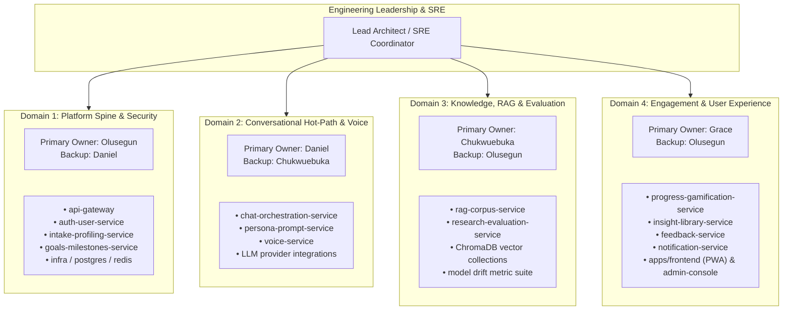
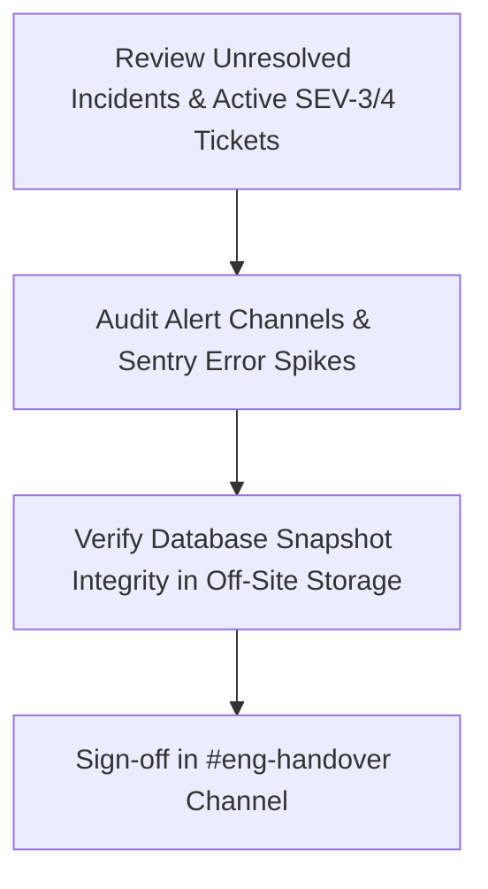

# Service Ownership & Maintenance Governance

- **Document Version:** 1.0.0 (Post-MVP Production Baseline)
- **Area:** Engineering Leadership & Governance
- **Scope:** Defines long-term ownership, RACI matrix, Tier classifications, SLOs/SLIs, lifecycle policies, and on-call escalation procedures for all 13 microservices and frontend clients.
- **Related Documents:** [System Architecture](../architecture/system-architecture.md), [Operational Runbooks](../operations/operational-runbooks.md)

---

## 1. Domain Ownership & Team Charters

To sustain operational excellence and rapid product evolution beyond the initial MVP, services are partitioned into four cohesive domain areas:



---

## 2. Service Ownership Matrix & Service Level Objectives (SLOs)

### 2.1 Tier Definitions
- **Tier 1 (Mission Critical):** Direct synchronous user interaction or ingress security. Outage directly prevents users from chatting or logging in. Target Availability: **99.9%** (Downtime < 43m/mo).
- **Tier 2 (Core Domain):** Essential product flows (intake, goals, gamification) with graceful asynchronous fallback. Target Availability: **99.5%** (Downtime < 3.6h/mo).
- **Tier 3 (Supporting & Research):** Asynchronous evaluation, research auditing, content library updates, and batch notifications. Target Availability: **99.0%** (Downtime < 7.2h/mo).

---

### 2.2 Comprehensive Service RACI & SLO Table

| Service / Container | Tier | Primary Owner | Secondary Owner | Repo Path | Datastore | Domain Events | SLO Availability | SLO Latency (p95) |
|---|---|---|---|---|---|---|---|---|
| **`api-gateway`** | **Tier 1** | Olusegun | Daniel | `services/api-gateway` | Redis (Cache/RateLimit) | N/A (Ingress proxy) | **99.95%** | < 15ms routing overhead |
| **`auth-user-service`** | **Tier 1** | Olusegun | Daniel | `services/auth-user-service` | Postgres (`svc_auth`) | Pub: `user.registered`, `user.login` | **99.9%** | < 80ms |
| **`chat-orchestration`** | **Tier 1** | Daniel | Chukwuebuka | `services/chat-orchestration-service` | Postgres (`svc_chat`) | Pub: `chat.turn_completed`, `session.ended` | **99.9%** | < 1,200ms TTFT |
| **`persona-prompt`** | **Tier 1** | Daniel | Chukwuebuka | `services/persona-prompt-service` | Postgres (`svc_persona`) | N/A (Sync context) | **99.9%** | < 35ms render |
| **`rag-corpus-service`** | **Tier 1** | Chukwuebuka | Daniel | `services/rag-corpus-service` | Postgres (`svc_rag`) + ChromaDB | Sub: `corpus.updated` | **99.5%** | < 250ms vector query |
| **`voice-service`** | **Tier 2** | Daniel | Grace | `services/voice-service` | Local/S3 Audio Storage | Pub: `voice.transcribed` | **99.0%** | < 2,500ms audio chunk |
| **`intake-profiling`** | **Tier 2** | Olusegun | Grace | `services/intake-profiling-service` | Postgres (`svc_intake`) | Pub: `intake.completed` | **99.5%** | < 120ms |
| **`goals-milestones`** | **Tier 2** | Olusegun | Grace | `services/goals-milestones-service` | Postgres (`svc_goals`) | Pub: `goal.created`, `milestone.completed` | **99.5%** | < 90ms |
| **`progress-gamification`** | **Tier 2** | Grace | Olusegun | `services/progress-gamification-service` | Postgres (`svc_progress`) | Sub: `milestone.*`, `intake.*`, `session.*` | **99.5%** | < 80ms (Async lag < 2s) |
| **`insight-library`** | **Tier 3** | Grace | Chukwuebuka | `services/insight-library-service` | Postgres (`svc_insight`) | N/A | **99.0%** | < 100ms |
| **`feedback-service`** | **Tier 3** | Grace | Daniel | `services/feedback-service` | Postgres (`svc_feedback`) | Pub: `feedback.submitted` | **99.0%** | < 100ms |
| **`research-evaluation`** | **Tier 3** | Chukwuebuka | Olusegun | `services/research-evaluation-service` | Postgres (`svc_eval`) / SQLite | Sub: `chat.*`, `feedback.*`; Pub: `drift.detected` | **99.0%** | Batch processing |
| **`notification-service`** | **Tier 3** | Grace | Olusegun | `services/notification-service` | Redis / Celery | Sub: `goal.*`, `milestone.*`, `streak.*` | **99.0%** | Async delivery < 30s |
| **`apps/frontend`** | **Tier 1** | Grace | Daniel | `frontend/` (Next.js PWA) | LocalStorage / IndexedDB | Consumes Gateway REST/SSE | **99.9%** | CWV LCP < 2.0s, INP < 150ms |
| **`apps/admin-console`** | **Tier 3** | Olusegun | Chukwuebuka | `apps/admin-console` | N/A | Consumes Gateway Admin REST | **99.0%** | Initial Load < 2.5s |

---

## 3. Service Lifecycle & Maintenance Standards

### 3.1 Definition of Done (DoD) for Microservices
No new service or major feature is accepted into `develop` or production without satisfying the following criteria:

```mermaid
checklist
    title Microservice Acceptance Criteria
    - [x] OpenAPI 3.1 contract documented in docs/api/<service>.yaml
    - [x] Unit test coverage >= 85% with passing pytest suite
    - [x] Healthcheck endpoint (/health) verifies internal DB/Redis connectivity
    - [x] Structured JSON logging via app/observability.py with Correlation ID
    - [x] Database migrations managed via Alembic (Zero-downtime expand/contract)
    - [x] Dockerfile builds cleanly and runs as a non-root user
    - [x] Prometheus metrics exposed on /metrics
```

---

### 3.2 API Versioning & Deprecation Policy
- **Semantic Versioning:** All public endpoints are prefixed with `/api/v1/`.
- **Backward Compatibility:** Additive changes (new optional fields) do not require a major version bump.
- **Breaking Changes:** Require an ADR approved by the Architecture Review Board (ARB) and a minimum **60-day deprecation notice** with header `Sunset: <date>`.

---

### 3.3 Security Patching & Vulnerability Remediation SLAs
- **Critical (CVSS 9.0 - 10.0):** Patch applied and deployed within **48 hours**.
- **High (CVSS 7.0 - 8.9):** Patch applied and deployed within **7 calendar days**.
- **Medium (CVSS 4.0 - 6.9):** Scheduled for next bi-weekly sprint cycle.

---

## 4. On-Call Governance & Escalation

### 4.1 On-Call Handover Protocol
On-call rotations change weekly on **Mondays at 09:00 UTC**. The handover ceremony requires completing the checklist:



### 4.2 Escalation Matrix

```
┌─────────────────────────────────────────────────────────────┐
│ 1. Primary On-Call Engineer (Initial triage within 15 mins) │
└──────────────────────────────┬──────────────────────────────┘
                               │ Unresolved after 30 mins
                               ▼
┌─────────────────────────────────────────────────────────────┐
│ 2. Secondary Service Area Owner (Specialist Deep Dive)      │
└──────────────────────────────┬──────────────────────────────┘
                               │ Unresolved after 60 mins
                               ▼
┌─────────────────────────────────────────────────────────────┐
│ 3. Engineering Lead / Incident Commander (All-Hands Mobilize)│
└─────────────────────────────────────────────────────────────┘
```

---

## 5. Architectural Review Board (ARB) Governance

The ARB consists of the four service area owners and convenes bi-weekly or upon request for major technical proposals:

1. **When an RFC / ADR is Required:**
   - Adding a new microservice or datastore.
   - Modifying domain event schemas in `afrimentor.events`.
   - Modifying public authentication or cryptographic key handling.
   - Introducing external SaaS dependencies or third-party AI providers.
2. **Review Process:**
   - Author files markdown draft in `docs/adr/000X-<title>.md`.
   - Minimum 2 approvals required from domain peers prior to merge.
