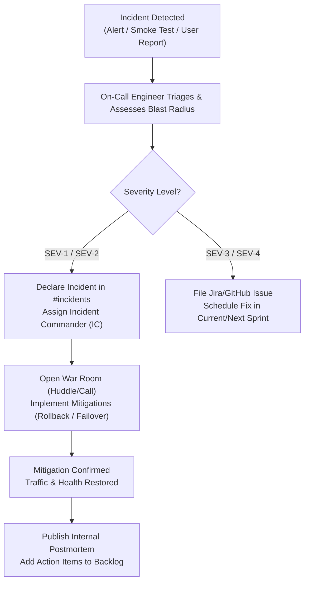
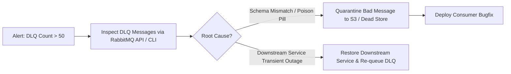

# Operational Runbooks & Site Reliability Engineering (SRE) Guide

- **Document Version:** 1.0.0 (Production Maintenance Baseline)
- **Area:** Engineering Leadership & Operations
- **Scope:** Complete day-to-day operations, incident response, disaster recovery, and maintenance across all 13 microservices.
- **Related Documents:** [System Architecture](../architecture/system-architecture.md), [Service Ownership](../governance/service-ownership.md), [Observability](../observability.md)

---

## 1. Incident Management Framework

### 1.1 Incident Severity Levels

| Severity | Definition | Target Response (MTTA) | Target Resolution (MTTR) | Example Scenarios |
|---|---|---|---|---|
| **SEV-1 (Critical)** | Complete platform outage; chat hot-path completely down; critical security breach or data loss. | < 15 minutes | < 2 hours | API Gateway failing all traffic; Auth service key corruption; PostgreSQL offline; LLM hot-path down with no fallback. |
| **SEV-2 (High)** | Core capability severely degraded; chat response latency p95 > 5s; background event processing completely stalled. | < 30 minutes | < 4 hours | RAG vector search failing (falling back to ungrounded LLM); RabbitMQ broker unresponsive; Voice uploads failing. |
| **SEV-3 (Medium)** | Non-critical feature broken or degraded; admin/research console error; gamification XP delayed. | < 2 hours | < 24 hours | Gamification streak update lagging; insight card bookmarks failing; daily evaluation drift batch job failure. |
| **SEV-4 (Low)** | Minor cosmetic issue; internal metric scrape gap; minor non-customer-impacting bug. | Next business day | Next sprint | Typo in notification template; missing dashboard widget; non-critical log noise. |

---

### 1.2 Incident Command Protocol



---

## 2. Routine Maintenance Procedures

### 2.1 Zero-Downtime Deployment & Rolling Updates

#### Staging Deployment
```bash
# Pull latest code and deploy staging overlay
git checkout develop && git pull origin develop
./scripts/deploy-staging.sh
```

#### Production Rolling Container Restart
To update a single service without disrupting peers:
```bash
# Rebuild and restart the targeted service with zero impact on unrelated containers
docker compose -f docker-compose.yml -p afrimentor-prod build chat-orchestration-service
docker compose -f docker-compose.yml -p afrimentor-prod up -d --no-deps chat-orchestration-service

# Verify health status
docker compose -f docker-compose.yml -p afrimentor-prod ps chat-orchestration-service
```

---

### 2.2 Database Schema Migrations (Alembic)

All relational database migrations follow the **Expand and Contract** pattern to prevent locking or breaking running instances:

1. **Phase 1 (Expand):** Add new columns/tables as nullable or with defaults. Deploy migration.
2. **Phase 2 (Code Release):** Deploy code reading/writing to new columns.
3. **Phase 3 (Contract):** Backfill historical rows and deprecate/drop unused columns in a subsequent sprint.

#### Applying Migrations to a Dedicated Service Database
```bash
# Example: Running migrations on goals-milestones-service
docker compose exec goals-milestones-service alembic upgrade head

# Rollback one migration revision in emergency
docker compose exec goals-milestones-service alembic downgrade -1
```

---

### 2.3 Secrets & RSA Key Rotation

#### RS256 JWT Signing Key Rotation (`auth-user-service` & `api-gateway`)
1. Generate a new RSA 4096-bit keypair:
   ```bash
   openssl genpkey -algorithm RSA -out /tmp/jwt_private_v2.pem -pkeyopt rsa_keygen_bits:4096
   openssl rsa -pubout -in /tmp/jwt_private_v2.pem -out /tmp/jwt_public_v2.pem
   ```
2. Update `api-gateway` with the new public key alongside the old public key in its key ring.
3. Deploy `api-gateway`.
4. Update `auth-user-service` with `/tmp/jwt_private_v2.pem` and restart.
5. After standard token expiration (7 days), remove the retired public key from `api-gateway`.

---

## 3. Component-by-Component Operational Runbooks

### 3.1 `api-gateway`
- **Port:** `8000`
- **Critical Dependencies:** Redis (`:6379`), downstream microservices.
- **Common Failure Modes:**
  - *502 Bad Gateway:* Downstream service container died or disconnected from the Docker bridge network.
  - *429 Too Many Requests Spike:* Client abuse or misconfigured client loop.
- **Diagnostic Commands:**
  ```bash
  # Check gateway access & error logs
  docker logs afrimentor-prod-api-gateway-1 --tail 100 -f
  
  # Inspect Redis rate-limiting latency
  docker exec -it afrimentor-prod-redis-1 redis-cli --latency
  ```

---

### 3.2 `chat-orchestration-service` & LLM Pipeline
- **Port:** `8003`
- **Critical Dependencies:** `persona-prompt-service`, `rag-corpus-service`, External LLMs.
- **Circuit Breaker & Fallbacks:**
  - If External LLM provider latency exceeds 8,000ms or returns 5xx:
    1. Automatic retry with exponential backoff (Tenacity: 3 attempts).
    2. Failover to secondary fallback provider (e.g., Groq / Mistral).
    3. If all LLM providers fail, return localized graceful message: *"Chioma is reviewing financial records, please check back in a moment."*
- **Diagnostic Commands:**
  ```bash
  # Check active streaming sessions
  docker exec -it afrimentor-prod-chat-orchestration-service-1 netstat -an | grep 8003
  ```

---

### 3.3 `rag-corpus-service` & ChromaDB
- **Port:** `8010` (Service), `8000` (ChromaDB)
- **Critical Dependencies:** ChromaDB vector storage volume.
- **Re-indexing the Financial Knowledge Corpus:**
  ```bash
  # Trigger full re-indexing of data-corpus/
  docker exec -it afrimentor-prod-rag-corpus-service-1 python -m app.scripts.ingest_corpus --force-reindex
  ```
- **Vector Search Latency Degradation Remediation:**
  If query latency exceeds 500ms:
  1. Check ChromaDB memory utilization (`docker stats afrimentor-prod-chromadb-1`).
  2. Optimize HNSW index parameters (decrease `ef_search` from 100 to 50 if CPU bound).

---

### 3.4 `progress-gamification-service` & Event Bus Consumers
- **Port:** `8005`
- **Critical Dependencies:** RabbitMQ `afrimentor.events` exchange.
- **Milestone & XP Desynchronization Reconciliation:**
  If a user reports missing XP after completing a milestone:
  ```bash
  # Trigger manual recalculation for a user
  docker exec -it afrimentor-prod-progress-gamification-service-1 python -m app.scripts.recalculate_user --user-id "<USER_UUID>"
  ```

---

## 4. Production Incident Triage Playbooks

### Playbook A: PostgreSQL Connection Pool Saturation (`QueuePool limit reached`)

**Symptom:** Services log `QueuePool limit of size X overflow Y reached, connection timed out`.

**Immediate Mitigation:**
1. Check active database connections:
   ```bash
   docker exec -it afrimentor-prod-postgres-1 psql -U afrimentor -d postgres -c \
   "SELECT datname, numbackends FROM pg_stat_database WHERE datname LIKE 'svc_%';"
   ```
2. Identify and terminate orphaned idle-in-transaction connections:
   ```bash
   docker exec -it afrimentor-prod-postgres-1 psql -U afrimentor -d postgres -c \
   "SELECT pg_terminate_backend(pid) FROM pg_stat_activity WHERE state = 'idle in transaction' AND state_change < current_timestamp - INTERVAL '5' MINUTE;"
   ```
3. Adjust pool sizing in service `.env` (`DB_POOL_SIZE=10`, `DB_MAX_OVERFLOW=20`) and restart affected service.

---

### Playbook B: RabbitMQ Queue Backlog & Dead Letter Queue (DLQ) Build-up

**Symptom:** Messages accumulating in `q.gamification.events` or unacknowledged count spiking.



**Re-queueing DLQ Messages:**
```bash
# Shovel dead letters back into main processing queue
docker exec -it afrimentor-prod-rabbitmq-1 rabbitmqadmin publish exchange="afrimentor.events" \
routing_key="retry.gamification" payload='{"action": "requeue"}'
```

---

### Playbook C: Stale Docker Network Attachment ("Unhealthy" Peers)

**Symptom:** A container is running and healthy on its own port, but neighboring containers get `httpx.ConnectError: [Errno 111] Connection refused` when trying to resolve its hostname.

**Resolution:**
```bash
# Force recreate container and re-attach to the docker bridge network
docker compose -f docker-compose.yml -p afrimentor-prod up -d --force-recreate <service-name>
```

---

## 5. Disaster Recovery & Backup Procedures

### 5.1 Automated Backup Schedule
- **Relational Databases (Postgres):** Daily full dump via `pg_dumpall` at 02:00 UTC stored with AES-256 encryption in off-site bucket storage. 30-day retention.
- **ChromaDB Vector Store:** Weekly snapshot of `/data/chroma` volume.
- **Persistent Voice Blobs:** Object storage with cross-region lifecycle replication.

---

### 5.2 Emergency Database Restoration Drill

```bash
# 1. Stop write traffic by putting gateway in maintenance mode
docker compose -p afrimentor-prod stop api-gateway

# 2. Restore PostgreSQL from verified backup dump
docker exec -i afrimentor-prod-postgres-1 psql -U afrimentor -d postgres < /backups/afrimentor_db_2026-08-27.sql

# 3. Verify table counts across logical databases
docker exec -it afrimentor-prod-postgres-1 psql -U afrimentor -d svc_auth -c "SELECT count(*) FROM users;"
docker exec -it afrimentor-prod-postgres-1 psql -U afrimentor -d svc_chat -c "SELECT count(*) FROM chat_messages;"

# 4. Restart API Gateway and verify health
docker compose -p afrimentor-prod start api-gateway
curl -f http://localhost:8000/health
```

