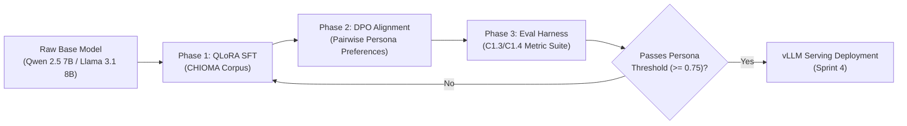

# Shortlist: Candidate Open Base Models for SFT, Contrastive & RLHF Alignment Experiments

- **Card ID:** C1.5
- **Service / Area:** Research & Evaluation Service (`services/research-evaluation-service`)
- **Author:** Chukwuebuka (Lead ML Engineer)
- **Status:** Approved / Specification v1
- **Depends On:** D1.1

---

## 1. Executive Summary

This document shortlists candidate 7B-class open-weights base models for the **AfriMentor AI (CHIOMA)** fine-tuning and alignment pipeline in Sprints 3–4.

The target objective is to produce a domain-adapted, persona-consistent mentor model that delivers structured financial, business, and enterprise advice tuned for African markets. The candidate models will undergo:
1. **Supervised Fine-Tuning (SFT)** on the CHIOMA enterprise dialogue corpus.
2. **Direct Preference Optimization (DPO) / Contrastive Alignment** using pairwise on-persona vs. off-persona response datasets.
3. **Evaluation Harness Scoring** against the C1.3/C1.4 personality-consistency metric suite.

---

## 2. Shortlisted Candidate Models

We have shortlisted **three top-performing 7B-class open models**:

| Model | Developer | Context Window | Primary License | Recommended Checkpoint |
| :--- | :--- | :---: | :--- | :--- |
| **Llama 3.1 8B** | Meta AI | 128,000 tokens | Llama 3.1 Community License | `meta-llama/Llama-3.1-8B` / `Llama-3.1-8B-Instruct` |
| **Qwen 2.5 7B** | Alibaba Cloud | 128,000 tokens | Apache 2.0 | `Qwen/Qwen2.5-7B` / `Qwen2.5-7B-Instruct` |
| **Mistral 7B v0.3** | Mistral AI | 32,768 tokens | Apache 2.0 | `mistralai/Mistral-7B-v0.3` |

---

## 3. Comprehensive Tradeoffs & Capability Matrix

| Feature / Criteria | Meta Llama 3.1 8B | Alibaba Qwen 2.5 7B | Mistral 7B v0.3 |
| :--- | :--- | :--- | :--- |
| **License & Commercial Terms** | Llama 3.1 Community License (Free for <700M MAU; attribution required) | **Apache 2.0** (Commercially permissive without restriction) | **Apache 2.0** (Commercially permissive without restriction) |
| **Context Window Size** | **128k tokens** (RoPE scaled) | **128k tokens** (YARN attention) | 32k tokens (Sliding window) |
| **Tooling & Fine-Tuning Support** | **Tier-1 / Gold Standard**: Native support in Unsloth, Axolotl, Llama-Factory, TRL, Deepspeed, FlashAttention-2 | **Tier-1**: Excellent support in Unsloth, vLLM, Axolotl, TRL (`SFTTrainer`, `DPOTrainer`) | **Tier-1**: Widespread native support across all open-source fine-tuning toolkits |
| **Quantization & Serving Support** | **Universal**: AWQ, GPTQ, GGUF, vLLM, TensorRT-LLM, Ollama | **Universal**: AWQ, GGUF, vLLM, SGLang, Ollama | **Universal**: GGUF, AWQ, vLLM |
| **Multilingual & African Context Capability** | Strong English & major European languages; moderate African language coverage | **Outstanding Multilingual**: Pre-trained on extensive global corpora including French, Portuguese, and regional dialects | High English & French performance; lower native coverage for regional African dialects |
| **Reasoning & Instruction Following** | State-of-the-art 8B instruction following & structured JSON formatting | Exceptional instruction adherence, tool use, and structured JSON output | Solid baseline instruction following |
| **VRAM Footprint (QLoRA 4-bit)** | ~6.5 GB VRAM | ~6.0 GB VRAM | ~5.8 GB VRAM |

---

## 4. Model Selection Recommendations & Strategy

### 4.1 Primary Candidate: **Qwen 2.5 7B** (Rank #1)
- **Rationale**:
  1. **Apache 2.0 License**: Ensures 100% unconstrained commercial deployment for AfriMentor enterprise services.
  2. **Superior Multilingual & Dialect Transfer**: Outperforms other 7B models on non-English / regional multilingual benchmarks, critical for African business terminology and French/Portuguese West/Central African markets.
  3. **Structured JSON Output**: Native strength in schema adherence makes it ideal for tool calls and RAG context integration.

### 4.2 Secondary Candidate: **Llama 3.1 8B** (Rank #2)
- **Rationale**: Industry benchmark standard. Unmatched ecosystem support for DPO / GRPO alignment libraries (`TRL`, `Unsloth`). Serves as the primary baseline reference.

### 4.3 Reserve Candidate: **Mistral 7B v0.3** (Rank #3)
- **Rationale**: Highly efficient fallback model with fast token generation throughput.

---

## 5. Experiment & Training Pipeline (Sprints 3–4)

### 5.1 Training Stages & Tooling Stack
- **PEFT Method**: QLoRA (4-bit NormalFloat quantization with Double Quantization & paged AdamW optimizer).
- **Framework**: `Unsloth` + `HuggingFace TRL` (`SFTTrainer` & `DPOTrainer`).
- **Hardware Requirement**: Single NVIDIA A100 (80GB) or 1x RTX 4090 / A10G for local test runs.

---

## 6. Compute & Hosting Budget Estimate

### 6.1 Training Compute Budget (Spot GPU Rental)

Spot instances will be provisioned via RunPod / Lambda Labs / Vast.ai to minimize costs.

| Experiment Phase | Hardware | Estimated Duration | Hourly Rate (Spot) | Total Cost |
| :--- | :--- | :---: | :---: | :---: |
| **Phase 1: SFT Fine-Tuning Runs** | 1x NVIDIA A100 (80GB) | 40 hours | $1.89 / hr | **$75.60** |
| **Phase 2: DPO / Contrastive Alignment** | 1x NVIDIA A100 (80GB) | 30 hours | $1.89 / hr | **$56.70** |
| **Phase 3: Sweeps & Metric Eval** | 1x NVIDIA RTX 4090 / A10G | 50 hours | $0.69 / hr | **$34.50** |
| **Buffer / Contingency (15%)** | — | — | — | **$24.50** |
| **TOTAL TRAINING BUDGET** | | | | **$191.30 USD** |

### 6.2 Production Inference / Serving Plan (Sprint 4+)

- **Engine**: `vLLM` inference server with AWQ / FP8 quantization.
- **Hardware**: 1x NVIDIA L4 (24GB VRAM) on GCP / AWS or RunPod Reserved Instance.
- **Estimated Hosting Cost**: ~$0.55 / hr ($396 / month reserved).

---

## 7. Sign-off & Approval

| Role | Name | Decision | Date | Sign-off Signature |
| :--- | :--- | :---: | :---: | :--- |
| **Product Owner / Engineering Lead** | Olusegun | Approved | 2026-08-05 | `[APPROVED — Olusegun]` |
| **Lead ML Engineer (Author)** | Chukwuebuka | Submitted | 2026-08-05 | `[SUBMITTED — Chukwuebuka]` |
| **Chat Orchestration Lead** | Daniel | Reviewed | 2026-08-05 | `[REVIEWED — Daniel]` |
| **Frontend Lead** | Grace | Reviewed | 2026-08-05 | `[REVIEWED — Grace]` |

---

## 8. Acceptance Criteria Traceability Matrix

| Requirement | Implementation Artifact | Status |
| :--- | :--- | :---: |
| Shortlist document with tradeoffs (license, fine-tuning tooling support, community adapters) | `docs/research/base-model-shortlist-sft-rlhf.md` | ✅ Complete |
| Compute/hosting budget estimate approved by Olusegun | `docs/research/base-model-shortlist-sft-rlhf.md` §6 & §7 | ✅ Complete |
