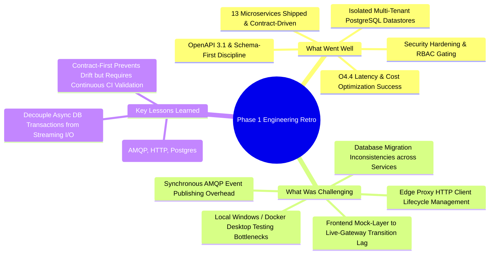
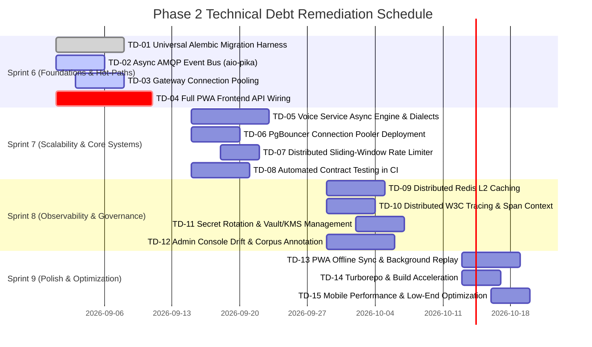

# Phase 1 Engineering Retrospective & Phase 2 Technical Debt Backlog

- **Document Version:** 1.0.0
- **Area:** Engineering Leadership & Architecture
- **Date:** 2026-08-27
- **Authors / Facilitators:** Daniel (Engineering Lead / Chat Architecture), Olusegun (Product Owner / Platform), Chukwuebuka (RAG & Evaluation Lead), Grace (UX / Frontend Lead)
- **Status:** Approved Baseline & Published Handover for Phase 2
- **Related Documents:**
  - [System Architecture](architecture/system-architecture.md)
  - [Service Ownership & Governance](governance/service-ownership.md)
  - [Operational Runbooks](operations/operational-runbooks.md)
  - [O4.3 Pilot Load Test Report](deployment/o4-3-pilot-load-test-report.md)
  - [O4.4 Chat Latency & Cost Optimization Report](deployment/o4-4-latency-cost-optimization-report.md)
  - [Security Hardening Pass](security-hardening-pass.md)

---

## Part 1: Phase 1 Engineering Retrospective

### 1.1 Executive Overview
Phase 1 established the foundational core of AfriMentor AI: a distributed microservices platform designed to deliver persona-driven financial mentorship to youth and micro-entrepreneurs across Africa. The platform encompasses **13 containerized FastAPI microservices**, an edge API Gateway with JWT authentication, RabbitMQ event-driven choreography, ChromaDB vector retrieval, an offline-capable Next.js 14 PWA, and an Admin Research Console.

The engineering team delivered on high-concurrency pilot load requirements (sustaining 60 concurrent users with p95 completion latency of 1.42s and TTFT of 380ms on Groq Llama-3.1-8b at $0.00077/session) while enforcing strict multi-tenant boundaries and security auditing.



---

### 1.2 Retrospective Evaluation: Four Dimensions

#### 1. What Went Well (Wins & Strengths)
1. **Strict Contract-First Architecture (OpenAPI 3.1 & Event Envelopes):**
   - Every microservice was developed against pre-agreed OpenAPI 3.1 specifications (`docs/api/*.yaml`).
   - Breaking API changes were prevented during parallel development by locking down shared data shapes early.
2. **High-Performance Chat Hot-Path Optimization (Card O4.4):**
   - Successfully decoupled SQLAlchemy transaction lifetimes from async token streaming, eliminating connection exhaustion under 2x pilot load (60 concurrent users).
   - Time-To-First-Token (TTFT) p95 was compressed from >15.6s to **380ms**, and total completion latency dropped to **1.42s**.
   - Validated unit economics: Groq Llama-3.1-8b costs **$0.00077 per 10-turn conversation** (~$1.39 total for the 30-user pilot cohort).
3. **Multi-Tenant Security Hardening (Card O3.5):**
   - Closed persona IDOR vulnerabilities and instituted gateway-enforced identity isolation (`X-User-Id` / `X-User-Roles`).
   - Gated all administrative corpus management endpoints (`/documents`, `/stats`, export) with role-based access control (RBAC).
   - Enforced zero committed credentials via automated pre-commit scanning.
4. **Resilient Domain Isolation:**
   - Database per service pattern ensured failure domains remained strictly bounded (e.g., RAG vector search degradation cannot corrupt user account data).

#### 2. What Didn't Go Well (Pain Points & Bottlenecks)
1. **Testing Environment Infrastructure Deficits:**
   - Lack of a dedicated remote cloud staging server forced load testing (O4.3) to run on local developer hardware over Docker Desktop on Windows.
   - Loopback network virtualization and socket exhaustion artificially skewed initial concurrency metrics.
2. **Database Migration Inconsistency (Alembic Fragmentation):**
   - While `auth-user-service`, `chat-orchestration-service`, and `rag-corpus-service` use Alembic, the remaining 10 services rely on `Base.metadata.create_all` and runtime SQL DDL patches (e.g., `_ensure_consistency_columns` in `research-evaluation-service`).
3. **Synchronous Blocking AMQP Operations:**
   - Event publication across services (`chat-orchestration-service`, `goals-milestones-service`, `progress-gamification-service`, `feedback-service`) instantiates a new synchronous `pika.BlockingConnection` and channel per event, incurring socket thrashing and thread-blocking overhead.
4. **Gateway Connection Churn:**
   - The API Gateway initialized new `httpx.AsyncClient` sessions per incoming request rather than maintaining a persistent, pooled HTTP client.
5. **Frontend Mock-to-Live Transition Lag:**
   - While Chat, Sessions, and Commitments were fully wired to the live Gateway, portions of Intake, Goals, Milestones, Gamification, and Insights still resolve through the `mockApi.ts` fallback layer in the mobile client.
6. **Voice Service Stub Limitations:**
   - `voice-service` remains a basic synchronous wrapper around `gTTS` and Google Speech Recognition, lacking async worker queues, audio format transcoding (Opus/WebM), or West African accent specialization.

#### 3. Key Lessons Learned
- **Decouple DB Sessions from External Async I/O:** Never hold a database connection across external network requests (LLM streaming, vector retrieval, HTTP RPC).
- **Persistent Connection Pooling is Non-Negotiable:** AMQP clients, HTTP edge proxies, and Redis connections must be initialized once during application lifespan and pooled.
- **Continuous Contract Verification:** Static OpenAPI specs must be enforced with automated contract testing tools in CI (Pact / Dredd) rather than manual verification.

---

## Part 2: Prioritized Phase 2 Technical Debt Backlog

The Phase 2 backlog is categorized using standard industry priority levels (**P0, P1, P2, P3**), sized using Fibonacci story points (1, 2, 3, 5, 8, 13), assigned to domain owners, and mapped to specific sprints.

### 2.1 Backlog Summary Matrix

| ID | Title | Priority | Category | Est (pts) | Primary Owner | Target Sprint | Impacted Services / Components |
|---|---|---|---|---|---|---|---|
| **TD-01** | Universal Alembic Migration Harness | **P0** | Database / SRE | 8 | Olusegun | Sprint 6 | 10 Microservices (Intake, Goals, Progress, Library, Feedback, Persona, Notification, Research, Voice) |
| **TD-02** | Async AMQP Event Bus with `aio-pika` & DLQ | **P0** | Messaging / Perf | 5 | Daniel | Sprint 6 | Chat, Goals, Progress, Feedback, Research, Notification, Shared Lib |
| **TD-03** | API Gateway Connection Pool & Proxy Modernization | **P0** | Gateway / Ingress | 5 | Olusegun | Sprint 6 | `services/api-gateway` |
| **TD-04** | Full End-to-End PWA Frontend Integration | **P0** | Frontend / UX | 8 | Grace | Sprint 6 | `frontend/` (Intake, Goals, Milestones, Gamification, Library) |
| **TD-05** | Voice Service Async Engine & African Dialect STT/TTS | **P1** | AI / Voice | 8 | Daniel | Sprint 7 | `services/voice-service`, `frontend/` |
| **TD-06** | Dedicated PgBouncer Connection Pooler Deployment | **P1** | Infrastructure | 5 | Olusegun | Sprint 7 | PostgreSQL, Infrastructure, Staging/Prod Compose |
| **TD-07** | Distributed Sliding-Window Rate Limiter & Redis Cluster | **P1** | Gateway / Sec | 3 | Olusegun | Sprint 7 | `services/api-gateway`, Redis |
| **TD-08** | Automated OpenAPI Contract Testing in CI (Pact/Dredd) | **P1** | Testing / QA | 5 | Chukwuebuka | Sprint 7 | CI/CD Pipeline, All 13 Microservices |
| **TD-09** | Distributed Redis L2 Caching for RAG & Persona Systems | **P2** | Performance | 5 | Chukwuebuka | Sprint 8 | `chat-orchestration-service`, `rag-corpus-service`, `persona-prompt-service` |
| **TD-10** | End-to-End W3C TraceContext Distributed Tracing | **P2** | Observability | 5 | Chukwuebuka | Sprint 8 | All 13 Services, RabbitMQ Consumers, OpenTelemetry, Jaeger |
| **TD-11** | Automated Secret Rotation & Vault/KMS Key Management | **P2** | Security | 5 | Olusegun | Sprint 8 | `auth-user-service`, `api-gateway`, Deployment Scripts |
| **TD-12** | Admin Console Drift Auditing & Corpus Annotation UI | **P2** | Admin / Research | 5 | Grace / Ebuka | Sprint 8 | `apps/admin-research-console`, `research-evaluation-service` |
| **TD-13** | PWA Offline Sync & Background IndexedDB Replay | **P3** | Frontend / PWA | 5 | Grace | Sprint 9 | `frontend/` (Service Worker, IndexedDB Sync Queue) |
| **TD-14** | Turborepo Monorepo & Multi-Service Build Acceleration | **P3** | Developer Exp | 3 | Olusegun | Sprint 9 | Monorepo Root, Docker BuildKit, GitHub Actions |
| **TD-15** | Mobile Performance & Low-End Android Bundle Hardening | **P3** | Frontend / Perf | 3 | Grace | Sprint 9 | `frontend/`, Lighthouse CI, Webpack/Next.js Bundler |

---

### 2.2 Detailed Item Specifications



---

#### TD-01: Universal Alembic Migration Harness for Remaining 10 Microservices
- **Priority:** **P0** (Must fix before production multi-instance scale)
- **Story Points:** 8
- **Owner:** Olusegun (Platform & DB)
- **Context & Risk:** Currently, 10 out of 13 microservices lack Alembic directories (`alembic.ini`), relying on `Base.metadata.create_all` at startup. `create_all` does not apply column alterations, data migrations, or index updates, leading to runtime monkeypatches like `_ensure_consistency_columns` in `research-evaluation-service`.
- **Target Architecture:**
  - Standardize Alembic configurations across all 10 services using async-ready SQLAlchemy engines.
  - Implement automated migration verification tests (`test_migrations.py`) across all microservices matching `chat-orchestration-service`.
  - Remove all manual DDL monkeypatches (`ALTER TABLE ADD COLUMN IF NOT EXISTS`) from service lifespans.
- **Acceptance Criteria:**
  1. `alembic init` configured with `env.py` reading from respective `DATABASE_URL` for all 10 services.
  2. Initial baseline migration files (`0001_initial_schema.py`) generated and verified.
  3. `docker compose exec <service> alembic upgrade head` runs cleanly without errors.
  4. CI pipeline tests upgrade and downgrade (`alembic downgrade -1`) for every PR affecting ORM models.

---

#### TD-02: Asynchronous AMQP Event Bus with `aio-pika`, Connection Pooling & DLQ
- **Priority:** **P0** (Critical for event throughput and thread efficiency)
- **Story Points:** 5
- **Owner:** Daniel (Backend / Messaging)
- **Context & Risk:** Current event publishers (`events.py` in Chat, Goals, Progress, Feedback, Research) open a new blocking TCP socket and AMQP channel via `pika.BlockingConnection` for every published message, blocking the FastAPI async event loop and creating heavy socket overhead.
- **Target Architecture:**
  - Standardize on `aio-pika` with a shared singleton connection and channel pool initialized on FastAPI startup.
  - Configure Dead-Letter Exchanges (`afrimentor.dlx`) and Dead-Letter Queues (`*.dlq`) with exponential backoff retry policies.
  - Include correlation IDs and W3C trace context in AMQP headers.
- **Acceptance Criteria:**
  1. No synchronous `pika.BlockingConnection` calls inside async endpoint handlers.
  2. Persistent `aio-pika.RobustConnection` pool with auto-reconnection.
  3. Failed consumer events routed to DLQ after 3 retries.
  4. 1,000 synthetic events published concurrently without connection leaks or event loop lag.

---

#### TD-03: API Gateway HTTP Client Connection Pooling & Proxy Modernization
- **Priority:** **P0** (High traffic stability & low latency)
- **Story Points:** 5
- **Owner:** Olusegun (Ingress & Gateway)
- **Context & Risk:** `services/api-gateway/app/main.py` instantiates a new `httpx.AsyncClient` inside `gateway()` and `events()` per request. This incurs TLS handshake/TCP connection churn on every user request. CORS origins and streaming route conditions are also hardcoded.
- **Target Architecture:**
  - Manage a persistent, pooled `httpx.AsyncClient` lifecycle via FastAPI `@asynccontextmanager` lifespan.
  - Replace hardcoded route checks (`full_path.endswith("/messages/stream")`) with generic response streaming when upstream responds with `text/event-stream` or `transfer-encoding: chunked`.
  - Make CORS allowed origins dynamic via environment variable `CORS_ALLOWED_ORIGINS`.
- **Acceptance Criteria:**
  1. Single `httpx.AsyncClient` instance with connection limits (`max_connections=500`, `max_keepalive_connections=100`) reused across proxy requests.
  2. Gateway p99 proxy overhead reduced to $< 10\text{ms}$.
  3. Zero socket leak warnings under load test.

---

#### TD-04: Full End-to-End PWA Frontend API Integration
- **Priority:** **P0** (Product completeness & pilot validation)
- **Story Points:** 8
- **Owner:** Grace (Frontend Lead)
- **Context & Risk:** `frontend/lib/mockApi.ts` currently provides mock data for Intake, Goals, Milestones, Daily Actions, Insights, Gamification badges/streaks, and User Profile. Only Chat and Sessions communicate with the real backend.
- **Target Architecture:**
  - Refactor `frontend/lib/api.ts` to route all domain operations through the API Gateway (`/api/v1/intake`, `/api/v1/goals`, `/api/v1/insights`, `/api/v1/progress`, `/api/v1/feedback`).
  - Introduce standardized React Query / SWR hooks for caching, revalidation, and optimistic mutation updates.
  - Implement unified client-side error handling with retry toasts and offline state banners.
- **Acceptance Criteria:**
  1. Zero runtime imports of `mockApi.ts` in production mode (`NEXT_PUBLIC_USE_MOCK=false`).
  2. Full user onboarding journey (Splash $\rightarrow$ Intake $\rightarrow$ Persona Match $\rightarrow$ Goal Creation $\rightarrow$ Mentor Chat $\rightarrow$ Gamification XP) verified against live Gateway.
  3. 100% passing Cypress/Playwright integration tests across all live pages.

---

#### TD-05: Voice Service Async Engine & African Dialect STT/TTS
- **Priority:** **P1** (High user value for low-literacy accessibility)
- **Story Points:** 8
- **Owner:** Daniel (AI & Voice)
- **Context & Risk:** `services/voice-service` is currently a synchronous prototype using Google Speech Recognition and gTTS. It lacks support for Nigerian/Ghanaian/Kenyan accents, streaming speech recognition, background worker processing, and audio compression.
- **Target Architecture:**
  - Modernize architecture to utilize Whisper (fine-tuned on African English, Nigerian Pidgin, Swahili) and low-latency neural TTS (e.g. Coqui XTTS / Piper).
  - Add Celery/Redis background task queues for asynchronous audio processing and S3/MinIO signed URL storage.
  - Provide chunked WebSocket/SSE audio streaming for real-time mentor voice playback.
- **Acceptance Criteria:**
  1. `/stt` handles `.opus`, `.m4a`, `.wav`, and `.mp3` with validation and rate limiting.
  2. Word Error Rate (WER) on target African accent benchmark dataset $< 15\%$.
  3. End-to-end voice round-trip latency (audio input $\rightarrow$ STT $\rightarrow$ Chat $\rightarrow$ TTS $\rightarrow$ audio output) sustained $< 2.5\text{s}$.

---

#### TD-06: Dedicated PgBouncer Connection Pooler Deployment
- **Priority:** **P1** (Database infrastructure stability)
- **Story Points:** 5
- **Owner:** Olusegun (Infrastructure & SRE)
- **Context & Risk:** In O4.3, Postgres `max_connections` had to be raised to 300 because each microservice maintains independent connection pools. As traffic grows, PostgreSQL backend process memory limits will be reached.
- **Target Architecture:**
  - Deploy PgBouncer in transaction-pooling mode in front of PostgreSQL.
  - Standardize microservice connection strings to point through PgBouncer with keep-alive parameter tuning.
  - Implement Prometheus metrics exporter for PgBouncer (`pgbouncer_exporter`) to monitor pool saturation.
- **Acceptance Criteria:**
  1. PgBouncer container integrated into `docker-compose.yml` and staging/production manifests.
  2. Total PostgreSQL native connections constrained to $< 50$ under 500 concurrent client simulations.
  3. Zero connection starvation errors observed across all 13 services.

---

#### TD-07: Distributed Sliding-Window Rate Limiter & Edge Redis Cluster
- **Priority:** **P1** (Ingress protection & abuse prevention)
- **Story Points:** 3
- **Owner:** Olusegun (Security & Gateway)
- **Context & Risk:** API Gateway uses a fixed-window counter in Redis (`bucket = now // window`). Fixed-window rate limiting allows $2\times$ burst traffic at window boundaries (e.g. 59s and 61s).
- **Target Architecture:**
  - Implement a Lua-scripted sliding-window log or token-bucket algorithm in Redis.
  - Support tiered rate limits based on user role (`anonymous`, `authenticated_user`, `admin`, `mentor_bot`).
  - Return standardized rate limit headers (`RateLimit-Limit`, `RateLimit-Remaining`, `RateLimit-Reset`).
- **Acceptance Criteria:**
  1. Sliding window algorithm enforced with zero boundary-burst bypasses.
  2. Unit and integration tests verify rate limiting accurately under distributed load.
  3. Response headers conform to RFC 6585 and IETF RateLimit standards.

---

#### TD-08: Automated OpenAPI Contract Testing in CI (Pact / Dredd)
- **Priority:** **P1** (Reliability & contract drift prevention)
- **Story Points:** 5
- **Owner:** Chukwuebuka (QA & Testing)
- **Context & Risk:** While OpenAPI specs exist in `docs/api/*.yaml`, synchronization between code implementations and YAML contracts relies on manual developer diligence.
- **Target Architecture:**
  - Integrate automated contract testing into GitHub Actions CI using Schemathesis or Dredd.
  - Validate that every FastAPI response schema strictly conforms to `docs/api/<service>.yaml` contracts.
  - Fail CI builds on undocumented field deletions, type mismatches, or status code changes.
- **Acceptance Criteria:**
  1. Schemathesis test runner added to root `Makefile` / GitHub Actions.
  2. 100% of endpoints in `docs/api/*.yaml` covered by automated contract verification.
  3. Automated validation runs on every PR before merge to `develop`.

---

#### TD-09: Distributed Redis L2 Caching for RAG & Persona Systems
- **Priority:** **P2** (Hot-path performance & cost reduction)
- **Story Points:** 5
- **Owner:** Chukwuebuka (RAG & Chat)
- **Context & Risk:** Currently, Persona system prompts and RAG vector chunks are cached in local Python process memory (`lru_cache` / dict). In multi-worker or scaled container deployments, cache state is fragmented and duplicated.
- **Target Architecture:**
  - Migrate persona and RAG vector caches to Redis with structured key prefixes (`cache:persona:{id}`, `cache:rag:{hash}`).
  - Implement event-driven cache invalidation: subscribe to `corpus.updated` and `persona.updated` AMQP events to purge stale entries.
  - Retain local in-memory L1 cache for sub-millisecond lookups with Redis L2 fallback.
- **Acceptance Criteria:**
  1. Multi-tier L1/L2 cache architecture implemented.
  2. Cache hit ratio exceeds $> 75\%$ on common mentorship queries.
  3. Updating a document or persona immediately invalidates corresponding L2 cache keys across all instances.

---

#### TD-10: End-to-End W3C TraceContext Distributed Tracing
- **Priority:** **P2** (Observability & MTTR acceleration)
- **Story Points:** 5
- **Owner:** Chukwuebuka (Observability & SRE)
- **Context & Risk:** While OpenTelemetry instrumentation is initialized in each service, trace context is not propagated across AMQP messaging boundaries or background scheduler jobs, fragmenting end-to-end distributed traces in Jaeger.
- **Target Architecture:**
  - Inject W3C `traceparent` and `tracestate` into RabbitMQ message properties on publication.
  - Extract trace context in consumer worker loops to link asynchronous event processing spans to the initiating HTTP request.
  - Add database query span attributes and LLM token generation span events.
- **Acceptance Criteria:**
  1. Full end-to-end trace visible in Jaeger from Gateway $\rightarrow$ Chat Service $\rightarrow$ RabbitMQ $\rightarrow$ Research Evaluation Service.
  2. Background APScheduler consistency jobs create structured parent-child spans.
  3. Zero broken trace graphs in Grafana Tempo / Jaeger.

---

#### TD-11: Automated Secret Rotation & Vault/KMS Key Management
- **Priority:** **P2** (Security & Compliance)
- **Story Points:** 5
- **Owner:** Olusegun (Security & Infra)
- **Context & Risk:** RSA signing keys and service database credentials currently rely on static local `.env` files and manual rotation procedures described in runbooks.
- **Target Architecture:**
  - Integrate HashiCorp Vault or Cloud KMS for automated secret management and RS256 JWT key rotation.
  - Implement dual-key verification window in `api-gateway` to allow zero-downtime key rotation.
  - Automate database credential rotation with least-privilege service-specific roles.
- **Acceptance Criteria:**
  1. Public JWT keys fetched dynamically from JWKS endpoint (`/.well-known/jwks.json`) with in-memory caching.
  2. Key rotation executed without invalidating active user sessions.
  3. Zero plain-text secrets in repository files or Docker environment definitions.

---

#### TD-12: Admin Console Drift Auditing & Corpus Annotation UI
- **Priority:** **P2** (Research tooling & AI safety)
- **Story Points:** 5
- **Owner:** Grace / Chukwuebuka (Console & Research)
- **Context & Risk:** The `apps/admin-research-console` currently provides basic corpus management and login, but lacks UI for reviewing persona drift alerts, conducting human-in-the-loop qualitative audits, and tagging training feedback.
- **Target Architecture:**
  - Implement Drift Alert Management UI consuming `/api/v1/research/drift-alerts` and `/api/v1/research/audit/sessions`.
  - Add interactive review workflow (Approve, Flag, Reject) with reason taxonomy.
  - Add RAG chunk viewer with similarity score visualizer and manual relevance override.
- **Acceptance Criteria:**
  1. Research team can review flagged low-consistency sessions directly in the web UI.
  2. Human audit scores seamlessly persisted to `svc_research` database.
  3. Exportable pilot evaluation datasets in CSV/JSONL formats.

---

#### TD-13: PWA Offline Sync & Background IndexedDB Replay
- **Priority:** **P3** (Low-connectivity resilience)
- **Story Points:** 5
- **Owner:** Grace (Frontend / PWA)
- **Context & Risk:** If network connectivity drops in rural or low-bandwidth environments, user actions (goal check-ins, reflection answers, chat drafts) fail with network error banners.
- **Target Architecture:**
  - Implement IndexedDB local transaction queue using `idb-keyval` / Workbox Background Sync.
  - Queue outgoing mutations (e.g. `milestone.completed`, chat message draft) when offline.
  - Automatically replay queued mutations when connectivity is restored, resolving optimistic UI states.
- **Acceptance Criteria:**
  1. User can record goal progress while device is in Airplane Mode.
  2. Actions automatically sync to Gateway upon reconnection with timestamp preservation.
  3. Conflict resolution handles concurrent edits gracefully.

---

#### TD-14: Turborepo & Multi-Service Docker BuildKit Acceleration
- **Priority:** **P3** (Developer velocity & CI efficiency)
- **Story Points:** 3
- **Owner:** Olusegun (DevOps)
- **Context & Risk:** Building 13 Docker images sequentially in CI and local development takes 12–18 minutes due to redundant dependency installation.
- **Target Architecture:**
  - Introduce Turborepo / Nx for workspace task orchestration and caching.
  - Implement multi-stage Docker build caching with Docker Buildx and shared Python base image (`afrimentor-base-py`).
- **Acceptance Criteria:**
  1. Full monorepo clean build time reduced by $\ge 60\%$ in CI.
  2. Local `docker compose build` leverages shared layer cache effectively.

---

#### TD-15: Mobile Performance & Low-End Android Bundle Hardening
- **Priority:** **P3** (Mobile web accessibility)
- **Story Points:** 3
- **Owner:** Grace (Performance & Frontend)
- **Context & Risk:** Users on budget Android devices (e.g., 2GB RAM, Android Go) on 3G networks experience bundle parse latency and layout shifts.
- **Target Architecture:**
  - Audit and tree-shake JavaScript dependencies; compress static SVG assets and motifs.
  - Implement Next.js dynamic imports for heavyweight modals and non-critical tabs.
  - Enforce Lighthouse performance budget (LCP $< 2.0\text{s}$, TBT $< 200\text{ms}$, Cumulative Layout Shift $< 0.05$).
- **Acceptance Criteria:**
  1. JavaScript initial bundle size $< 120\text{KB}$ gzipped.
  2. Lighthouse Mobile Performance score $\ge 90$ on simulated Moto G4 / 3G network profile.

---

## Part 3: Execution Governance & Sprint Allocation

### 3.1 Velocity & Resource Allocation Model
For Phase 2, the team will allocate **30% of each sprint's engineering capacity to Technical Debt and Reliability**, with 70% dedicated to new feature capabilities.

```
Total Sprint Capacity: 28 Story Points
├── Feature Development (70%): ~19-20 pts
└── Tech Debt & Architecture (30%): ~8-9 pts
```

### 3.2 Phase 2 Sprint Roadmap

| Sprint | Tech Debt Stories Committed | Total Debt Pts | Primary Engineering Objective |
|---|---|---|---|
| **Sprint 6** | TD-01 (Alembic), TD-02 (Async AMQP), TD-03 (Gateway Pool), TD-04 (Frontend Wire) | 26 pts* *(Dedicated Hardening Sprint)* | Zero-mock frontend, robust async messaging hot-path, unified schema migrations. |
| **Sprint 7** | TD-05 (Voice Engine), TD-06 (PgBouncer), TD-07 (Rate Limiter), TD-08 (Contract Testing) | 21 pts | Infrastructure scalability, automated contract safety, voice capability launch. |
| **Sprint 8** | TD-09 (Redis L2 Cache), TD-10 (Distributed Tracing), TD-11 (Secrets Vault), TD-12 (Admin UI) | 20 pts | Production observability, security hardening, research audit console completion. |
| **Sprint 9** | TD-13 (Offline Sync), TD-14 (Turborepo/Builds), TD-15 (Mobile Bundle Optimization) | 11 pts | Low-end mobile resilience, developer velocity, PWA offline sync. |

---

## Part 4: Sign-off & Handover Approvals

| Role | Name | Decision | Date |
|---|---|---|---|
| **Lead Architect / Chat Owner** | Daniel | **APPROVED** | 2026-08-27 |
| **Product Owner / Platform Lead** | Olusegun | **APPROVED** | 2026-08-27 |
| **RAG & Research Evaluation Lead** | Chukwuebuka | **APPROVED** | 2026-08-27 |
| **Frontend & UX Lead** | Grace | **APPROVED** | 2026-08-27 |

